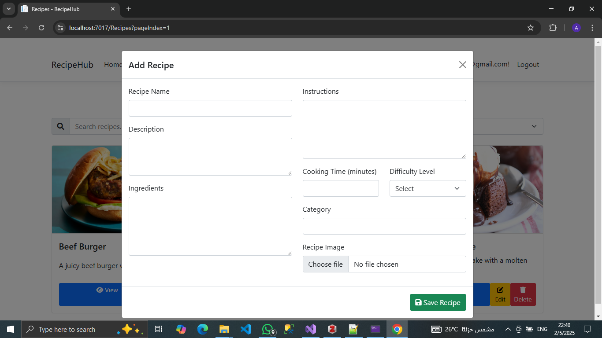
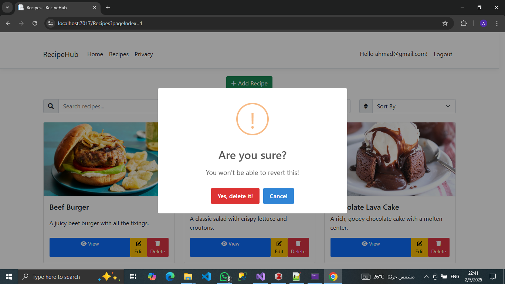
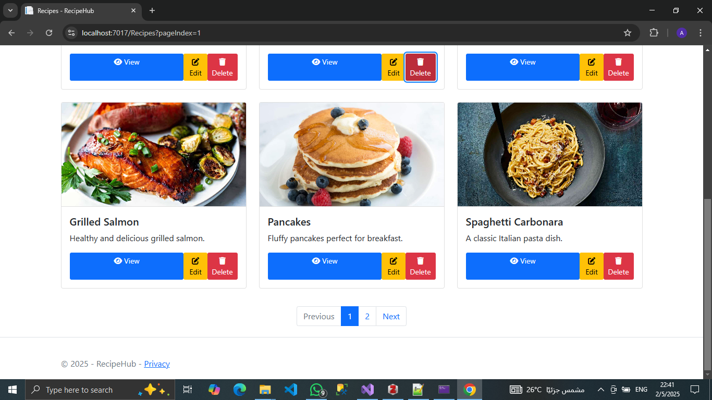

# Recipe Manager App

A modern ASP.NET Core Razor Pages application for managing and discovering delicious recipes. This app allows users to add, edit, delete, and view recipes with ease. It features a user-friendly interface, live search, sorting, filtering, and more.

## Features
- **Add Recipes**: Easily add new recipes with details like name, description, ingredients, instructions, cooking time, difficulty level, and category.
- **Edit Recipes**: Update existing recipes with new information.
- **Delete Recipes**: Remove recipes you no longer need.
- **Live Search**: Search for recipes in real-time.
- **Sorting and Filtering**: Sort recipes by name, cooking time, or difficulty level, and filter by category.
- **User-Friendly UI**: Clean and intuitive design with animations and icons.

## Screenshots

### Add Recipe Modal


### Confirmation


### Recipe List Page


## Technologies Used
- **ASP.NET Core**: Backend framework for building web applications.
- **Razor Pages**: Page-focused programming model for building dynamic web UIs.
- **Entity Framework Core**: ORM for database management.
- **Bootstrap**: Frontend framework for responsive design.
- **Font Awesome**: Icons for a better user experience.
- **SweetAlert**: For interactive alerts and modals.

## Getting Started

### Prerequisites
- [.NET 8.0 SDK](https://dotnet.microsoft.com/download/dotnet/8.0)
- [Visual Studio 2022](https://visualstudio.microsoft.com/) (optional but recommended)

### Installation
1. Clone the repository:
   ```bash
   git clone https://github.com/MasterWithAhmad/recipe-manager-app.git
   ```

   these aren't in the markdown:
2. Navigate to the project directory:
   ```bash
   cd recipe-manager-app
   ```
3. Restore dependencies:
   ```bash
   dotnet restore
   ```
4. Run the application:
   ```bash
   dotnet run
   ```
5. Open your browser and navigate to `https://localhost:5001`.

### Database Setup
1. Apply migrations to create the database:
   ```bash
   dotnet ef database update
   ```
2. Seed the database with sample recipes (if applicable).

## Contributing
Contributions are welcome! Please follow these steps:
1. Fork the repository.
2. Create a new branch(`git checkout -b feature/YourFeatureName`).
3. Commit your changes (`git commit -m 'Add some feature'`).
4. Push to the branch (`git push origin feature/YourFeatureName`).
5. Open a pull request.

## License
This project is licensed under the MIT License. See the [LICENSE](LICENSE) file for details.

---

Happy cooking! 🍳
